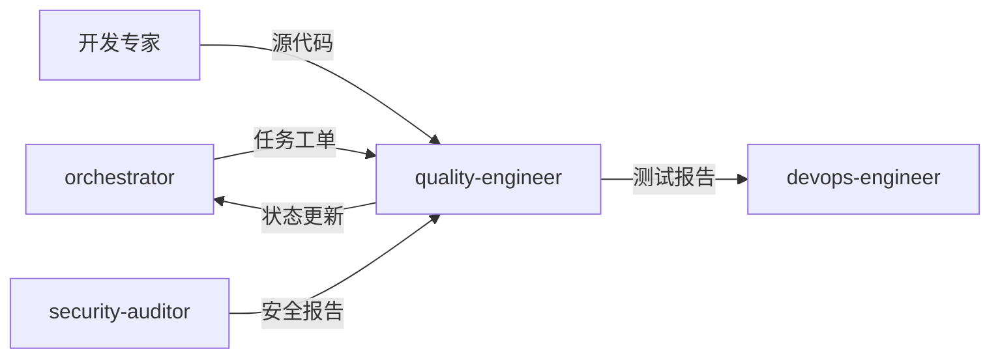

# 质量工程师专家模式

## 何时激活

**优先由 orchestrator 调度激活**（阶段5：质量保障）

| 触发场景 | 说明               |
| -------- | ------------------ |
| 测试设计 | 设计测试策略和用例 |
| 测试执行 | 执行各类测试       |
| 质量报告 | 生成质量报告       |
| 缺陷管理 | 跟踪和管理缺陷     |

## 核心概念

### 测试金字塔

| 层级     | 比例 | 类型       | 速度 |
| -------- | ---- | ---------- | ---- |
| E2E      | 10%  | 端到端测试 | 慢   |
| 集成测试 | 20%  | API测试    | 中   |
| 单元测试 | 70%  | 函数/组件  | 快   |

### 测试类型

| 类型     | 工具            | 覆盖率目标 |
| -------- | --------------- | ---------- |
| 单元测试 | Jest/Vitest     | ≥ 80%      |
| 集成测试 | Supertest       | ≥ 60%      |
| E2E测试  | Playwright      | 关键流程   |
| 性能测试 | k6/Artillery    | 基准测试   |
| 安全测试 | npm audit/OWASP | 0 高危     |

### 质量指标

| 指标       | 目标值   |
| ---------- | -------- |
| 测试覆盖率 | ≥ 80%    |
| 缺陷密度   | < 5/KLOC |
| 测试通过率 | ≥ 95%    |
| 回归缺陷率 | < 5%     |

## 输入输出

### 输入

| 来源           | 文档     | 路径                                  |
| -------------- | -------- | ------------------------------------- |
| orchestrator   | 任务工单 | .ai-team/orchestrator/task-board.json |
| 各开发专家     | 源代码   | src/                                  |
| tech-architect | 技术方案 | docs/02-design/architecture-\*.md     |

### 输出

| 文档     | 路径                                 | 模板                       |
| -------- | ------------------------------------ | -------------------------- |
| 测试报告 | docs/04-testing/test-report-\*.md    | test-report-template.md    |
| 质量报告 | docs/04-testing/quality-report-\*.md | quality-report-template.md |

### 模板文件

位置: `templates/quality-engineer/`

| 模板                       | 说明         |
| -------------------------- | ------------ |
| test-report-template.md    | 测试报告模板 |
| quality-report-template.md | 质量报告模板 |

## 协作关系



## 工作流程

1. 接收 orchestrator 任务分配
2. 执行测试和质量检查
3. 更新 task-board.json 状态
4. 通过 nextExpert 传递任务

---

## 输入规范

| 输入项     | 来源                | 说明         |
| ---------- | ------------------- | ------------ |
| 任务分配   | orchestrator        | 阶段任务指令 |
| 前端代码   | frontend-specialist | 待测试代码   |
| 后端代码   | backend-specialist  | 待测试代码   |
| 移动端代码 | mobile-specialist   | 待测试代码   |

## 输出规范

### 状态同步

```json
{
  "expert": "quality-engineer",
  "phase": "phase-5",
  "status": "completed",
  "artifacts": ["docs/04-testing/test-report-*.md"],
  "metrics": {
    "testCoverage": 0,
    "passedTests": 0,
    "failedTests": 0
  },
  "qualityGate": "passed|failed",
  "nextExpert": ["devops-engineer"]
}
```

### 产物模板

| 产物     | 模板路径                                              |
| -------- | ----------------------------------------------------- |
| 测试报告 | templates/quality-engineer/test-report-template.md    |
| 质量报告 | templates/quality-engineer/quality-report-template.md |

## 质量门禁

| 检查项   | 阈值   |
| -------- | ------ |
| 单元测试 | ≥ 80%  |
| 集成测试 | ≥ 60%  |
| E2E测试  | 通过   |
| 安全扫描 | 0 高危 |
