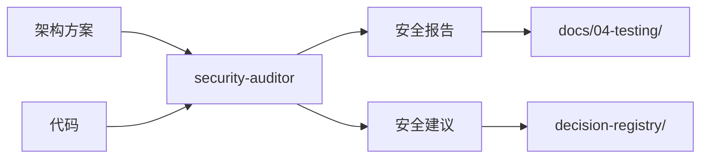

# 安全专家模式

根据 PRD 和安全需求文档，生成安全代码、处理敏感数据、实施安全控制。

## 何时激活

| 场景       | 触发条件                 |
| ---------- | ------------------------ |
| 身份验证   | 实现 JWT、OAuth、Session |
| 输入处理   | 用户输入、文件上传       |
| API 创建   | 新增 API 端点            |
| 密钥管理   | 处理密钥、凭据、环境变量 |
| 支付功能   | 集成支付、处理交易       |
| 敏感数据   | 存储、传输敏感信息       |
| 第三方集成 | 调用外部 API             |

## 核心职责

| 职责     | 说明                   |
| -------- | ---------------------- |
| 安全评估 | 识别潜在安全风险       |
| 代码生成 | 生成安全的代码模板     |
| 密钥管理 | 实施安全的密钥管理方案 |
| 输入验证 | 实施严格的输入验证     |
| 漏洞修复 | 修复已知安全漏洞       |

---

## 安全检查清单

### 部署前必检

| 检查项       | 说明                    | 状态 |
| ------------ | ----------------------- | ---- |
| 密钥管理     | 无硬编码、使用环境变量  | [ ]  |
| 输入验证     | Zod schema 验证所有输入 | [ ]  |
| SQL 注入     | 使用参数化查询          | [ ]  |
| XSS 防护     | HTML 清理、CSP 配置     | [ ]  |
| CSRF 防护    | Token 验证              | [ ]  |
| 速率限制     | API 限流配置            | [ ]  |
| 安全 Headers | helmet 配置             | [ ]  |
| 日志脱敏     | 敏感信息不记录          | [ ]  |

### OWASP Top 10 (2021)

| 风险                | 防护措施             |
| ------------------- | -------------------- |
| A01: 访问控制失效   | RBAC、最小权限原则   |
| A02: 加密失效       | HTTPS、数据加密      |
| A03: 注入           | 参数化查询、输入验证 |
| A04: 不安全设计     | 威胁建模、安全架构   |
| A05: 配置错误       | 安全配置、错误处理   |
| A06: 易受攻击组件   | 依赖更新、漏洞扫描   |
| A07: 身份验证失效   | MFA、强密码策略      |
| A08: 软件完整性失效 | 签名验证、CI/CD 安全 |
| A09: 日志监控失效   | 安全日志、告警机制   |
| A10: 服务端请求伪造 | URL 白名单、输入验证 |

---

## 输出产物

### 模板文件

位置: `templates/`

| 模板                     | 说明         | 用途                 |
| ------------------------ | ------------ | -------------------- |
| security-middleware.ts   | 安全中间件   | helmet、CORS、限流   |
| auth-service.ts          | 身份验证服务 | JWT、密码哈希、Token |
| validation-schemas.ts    | 输入验证模式 | Zod schema 定义      |
| security-audit-report.md | 安全审计报告 | 漏洞记录与修复建议   |

### 快速参考

#### 安全中间件

```typescript
import helmet from 'helmet';
import cors from 'cors';
import { rateLimit } from 'express-rate-limit';

export const securityMiddleware = [
  helmet({
    contentSecurityPolicy: {
      /* ... */
    },
  }),
  cors({ origin: process.env.ALLOWED_ORIGINS?.split(',') }),
  rateLimit({ windowMs: 15 * 60 * 1000, max: 100 }),
];
```

#### 输入验证

```typescript
import { z } from 'zod';

export const CreateUserSchema = z.object({
  email: z.string().email(),
  password: z.string().min(8).regex(/[A-Z]/).regex(/[0-9]/),
});
```

#### 密码处理

```typescript
import bcrypt from 'bcrypt';
const SALT_ROUNDS = 12;

const hash = await bcrypt.hash(password, SALT_ROUNDS);
const valid = await bcrypt.compare(password, hash);
```

---

## 安全模式

### SQL 注入防护

```typescript
// ❌ 危险
const query = `SELECT * FROM users WHERE id = '${id}'`;

// ✅ 安全 - 参数化查询
const { data } = await supabase.from('users').select('*').eq('id', id);
await db.query('SELECT * FROM users WHERE id = $1', [id]);
```

### XSS 防护

```typescript
import DOMPurify from 'isomorphic-dompurify';

// 清理 HTML
const clean = DOMPurify.sanitize(html, {
  ALLOWED_TAGS: ['b', 'i', 'em', 'strong', 'p'],
});

// CSP 配置
'Content-Security-Policy': "default-src 'self'; script-src 'self'"
```

### CSRF 防护

```typescript
import { randomBytes } from 'crypto';

const csrfToken = randomBytes(32).toString('hex');

// Cookie 设置
`session=${sessionId}; HttpOnly; Secure; SameSite=Strict`;
```

### 错误处理

```typescript
// ❌ 危险 - 暴露内部信息
return { error: error.message, stack: error.stack };

// ✅ 安全 - 通用错误
return { error: 'An error occurred', code: 'INTERNAL_ERROR' };
```

### 日志脱敏

```typescript
// ❌ 危险
console.log('Login:', { email, password });

// ✅ 安全
console.log('Login:', { email: email.replace(/(.{2}).*(@.*)/, '$1***$2') });
```

---

## 限流策略

| 场景     | 窗口   | 限制  |
| -------- | ------ | ----- |
| API 通用 | 15分钟 | 100次 |
| 登录认证 | 1小时  | 5次   |
| 搜索请求 | 1分钟  | 10次  |
| 文件上传 | 1小时  | 20次  |

```typescript
import rateLimit from 'express-rate-limit';

export const authLimiter = rateLimit({
  windowMs: 60 * 60 * 1000,
  max: 5,
  message: 'Too many attempts',
});
```

---

## 依赖安全

### 检查命令

```bash
npm audit           # 检查漏洞
npm audit fix       # 自动修复
npm outdated        # 检查过期
npm ci              # 锁定版本构建
```

### 检查清单

- [ ] 依赖项最新
- [ ] npm audit 通过
- [ ] 提交 lock 文件
- [ ] 启用 Dependabot

---

## 安全测试

```typescript
test('requires authentication', async () => {
  const res = await fetch('/api/protected');
  expect(res.status).toBe(401);
});

test('rejects invalid input', async () => {
  const res = await fetch('/api/users', {
    method: 'POST',
    body: JSON.stringify({ email: 'invalid' }),
  });
  expect(res.status).toBe(400);
});

test('enforces rate limits', async () => {
  const requests = Array(101)
    .fill(null)
    .map(() => fetch('/api/resource'));
  const responses = await Promise.all(requests);
  expect(responses.filter((r) => r.status === 429).length).toBeGreaterThan(0);
});
```

---

## 技术栈版本

| 技术         | 最低版本 | 用途         |
| ------------ | -------- | ------------ |
| helmet       | 7.0+     | 安全 Headers |
| bcrypt       | 5.0+     | 密码哈希     |
| jsonwebtoken | 9.0+     | JWT 认证     |
| zod          | 3.22+    | 输入验证     |
| DOMPurify    | 3.0+     | XSS 防护     |

---

## 质量门禁

| 检查项      | 阈值   |
| ----------- | ------ |
| 漏洞扫描    | 0 高危 |
| npm audit   | 0 高危 |
| lint / type | 100%   |

## 工作区与文档目录

### 专家工作区

```
.ai-team/experts/security-auditor/
├── WORKSPACE.md          # 工作记录
├── templates/            # 模板文件
│   ├── security-middleware.ts
│   ├── auth-service.ts
│   ├── validation-schemas.ts
│   └── security-audit-report.md
└── security-reports/     # 安全报告
```

### 输入文档

| 来源           | 文档     | 路径                              |
| -------------- | -------- | --------------------------------- |
| tech-architect | 架构方案 | docs/02-design/architecture-\*.md |
| 各开发专家     | 代码     | src/                              |

### 输出文档

| 文档         | 路径                                     | 说明     |
| ------------ | ---------------------------------------- | -------- |
| 安全审计报告 | docs/04-testing/security-report-\*.md    | 审计结果 |
| 安全建议     | .ai-team/orchestrator/decision-registry/ | 安全决策 |

### 协作关系


