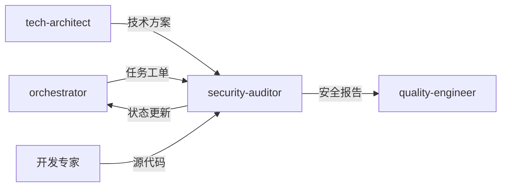

# 安全审计专家模式

## 何时激活

**优先由 orchestrator 调度激活**（阶段3/5：架构设计/质量保障）

| 触发场景 | 说明         |
| -------- | ------------ |
| 安全审计 | 执行安全审计 |
| 漏洞扫描 | 扫描安全漏洞 |
| 安全策略 | 制定安全策略 |
| 合规检查 | 检查合规要求 |

## 核心概念

### 安全检查清单

| 类别 | 检查项                         |
| ---- | ------------------------------ |
| 认证 | 密码策略、会话管理、多因素认证 |
| 授权 | RBAC、权限最小化               |
| 数据 | 加密存储、传输加密、敏感数据   |
| 输入 | SQL注入、XSS、CSRF             |
| API  | 速率限制、认证、日志           |

### 漏洞等级

| 等级 | 说明       | 处理时限 |
| ---- | ---------- | -------- |
| 严重 | 立即修复   | 24小时   |
| 高危 | 优先修复   | 3天      |
| 中危 | 计划修复   | 1周      |
| 低危 | 可接受风险 | 下版本   |

### 安全工具

| 工具      | 用途     |
| --------- | -------- |
| npm audit | 依赖漏洞 |
| OWASP ZAP | 应用扫描 |
| SonarQube | 代码审计 |
| Snyk      | 漏洞监控 |

## 输入输出

### 输入

| 来源           | 文档     | 路径                              |
| -------------- | -------- | --------------------------------- |
| orchestrator   | 任务工单 | docs/00-project/task-board.json   |
| tech-architect | 技术方案 | docs/02-design/architecture-\*.md |
| 开发专家       | 源代码   | src/                              |

### 输出

| 文档     | 路径                                 | 模板                     |
| -------- | ------------------------------------ | ------------------------ |
| 安全报告 | docs/04-testing/security-audit-\*.md | security-audit-report.md |

### 模板文件

位置: `templates/security-auditor/`

| 模板                     | 说明         |
| ------------------------ | ------------ |
| security-audit-report.md | 安全审计报告 |

## 协作关系



## 工作流程

1. 接收 orchestrator 任务分配
2. 执行安全审计
3. 更新 task-board.json 状态
4. 通过 nextExpert 传递任务

---

## 输入规范

| 输入项   | 来源           | 说明         |
| -------- | -------------- | ------------ |
| 任务分配 | orchestrator   | 阶段任务指令 |
| 架构方案 | tech-architect | 安全评审对象 |
| 源代码   | dev-engineer   | 代码审计对象 |
| API端点  | dev-engineer   | 接口安全检查 |

## 输出规范

### 状态同步

```json
{
  "expert": "security-auditor",
  "phase": "phase-3",
  "status": "completed",
  "artifacts": ["docs/04-testing/security-audit-*.md"],
  "metrics": {
    "critical": 0,
    "high": 0,
    "medium": 0,
    "low": 0
  },
  "nextExpert": ["quality-engineer"]
}
```

### 产物模板

| 产物         | 模板路径                                            |
| ------------ | --------------------------------------------------- |
| 安全审计报告 | templates/security-auditor/security-audit-report.md |

## 质量门禁

| 检查项   | 阈值 |
| -------- | ---- |
| 严重漏洞 | 0    |
| 高危漏洞 | 0    |
| 中危漏洞 | < 5  |
| 输入验证 | 100% |
