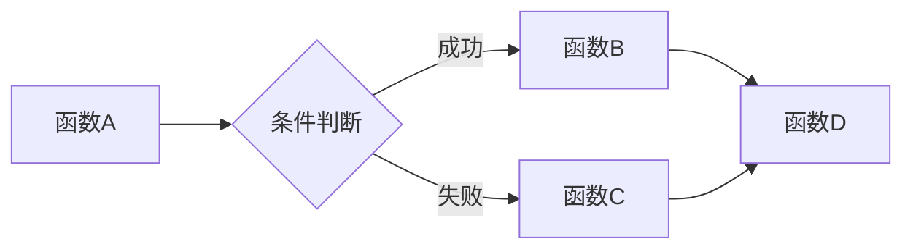

# 无服务器架构模式

> 按需运行，按量付费

## 核心概念

### Serverless特点

| 特点 | 说明 |
|------|------|
| 无服务器管理 | 无需管理基础设施 |
| 自动扩展 | 按需自动伸缩 |
| 按量付费 | 只为执行时间付费 |
| 事件驱动 | 由事件触发执行 |

### 适用场景

| 场景 | 说明 |
|------|------|
| API服务 | HTTP请求处理 |
| 数据处理 | ETL、文件处理 |
| 事件处理 | 消息队列、Webhook |
| 定时任务 | 定时调度执行 |

---

## 函数设计

### 函数粒度

| 策略 | 说明 | 适用场景 |
|------|------|----------|
| 单一职责 | 一个函数一个功能 | 简单操作 |
| 聚合函数 | 多个相关功能 | 减少调用次数 |
| 工作流 | 多函数编排 | 复杂流程 |

### 函数结构

```python
def handler(event, context):
    # 1. 输入验证
    validate_input(event)
    
    # 2. 业务逻辑
    result = process(event)
    
    # 3. 输出格式化
    return format_response(result)
```

### 冷启动优化

| 技术 | 说明 |
|------|------|
| 预留实例 | 保持实例预热 |
| 最小依赖 | 减少包大小 |
| 延迟加载 | 按需加载模块 |
| 连接复用 | 复用数据库连接 |

---

## 事件源

### 事件类型

| 类型 | 触发方式 | 示例 |
|------|----------|------|
| HTTP | API请求 | API Gateway |
| 存储 | 文件变更 | S3事件 |
| 消息 | 队列消息 | SQS、Kafka |
| 定时 | 定时触发 | EventBridge |
| 数据库 | 数据变更 | DynamoDB Stream |

### 事件格式

```json
{
  "source": "aws.s3",
  "type": "ObjectCreated",
  "detail": {
    "bucket": "my-bucket",
    "key": "data/file.csv"
  }
}
```

---

## 状态管理

### 无状态设计

| 原则 | 说明 |
|------|------|
| 不依赖本地存储 | 使用外部存储 |
| 不依赖内存状态 | 每次调用独立 |
| 幂等设计 | 重复执行结果一致 |

### 状态存储

| 存储 | 说明 | 适用场景 |
|------|------|----------|
| 数据库 | 持久化状态 | RDS、DynamoDB |
| 缓存 | 临时状态 | Redis、ElastiCache |
| 存储 | 文件状态 | S3、Blob Storage |

---

## 工作流编排

### 编排工具

| 工具 | 说明 |
|------|------|
| Step Functions | AWS工作流 |
| Durable Functions | Azure工作流 |
| Workflows | GCP工作流 |
| Temporal | 开源工作流 |

### 编排模式



---

## 成本优化

### 成本因素

| 因素 | 说明 |
|------|------|
| 执行次数 | 调用次数 |
| 执行时间 | 运行时长 |
| 内存配置 | 分配内存 |
| 数据传输 | 网络流量 |

### 优化策略

| 策略 | 说明 |
|------|------|
| 合理内存 | 根据需求配置 |
| 减少执行时间 | 优化代码性能 |
| 合并调用 | 减少函数调用次数 |
| 使用免费额度 | 利用免费层 |

---

## 平台对比

| 平台 | 函数服务 | 特点 |
|------|----------|------|
| AWS | Lambda | 生态完善 |
| Azure | Functions | .NET友好 |
| GCP | Cloud Functions | 简单易用 |
| 阿里云 | 函数计算 | 国内友好 |
| 腾讯云 | SCF | 微信生态 |

---

## 最佳实践

### 函数设计

- 保持函数小而专注
- 最小化依赖包
- 实现幂等性
- 处理超时和错误

### 性能优化

- 预留实例减少冷启动
- 连接池复用
- 异步处理长任务
- 合理配置内存

### 安全

- 最小权限原则
- 环境变量管理密钥
- VPC隔离敏感函数
- 启用日志和追踪

---

## 反模式

| 反模式 | 问题 | 解决方案 |
|--------|------|----------|
| 长时间运行 | 超时失败 | 拆分任务 |
| 大依赖包 | 冷启动慢 | 精简依赖 |
| 同步调用链 | 延迟叠加 | 异步处理 |
| 频繁调用 | 成本高 | 合并请求 |
