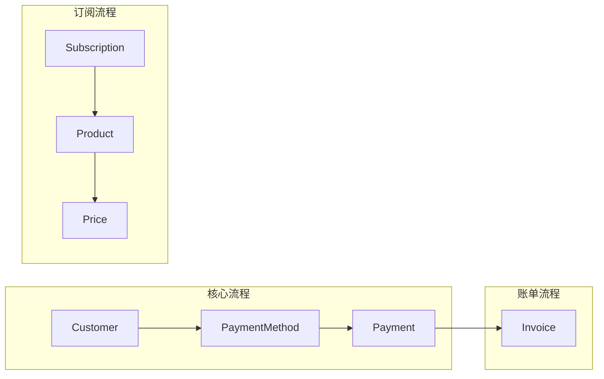

# Stripe 支付集成模式

> 订阅管理、支付处理、Webhook 处理的最佳实践

> **提示**：统一支付接口、退款、错误处理等通用模式请参考 [payment-patterns](../payment-patterns/SKILL.md)

## 何时激活

- 实现支付功能
- 订阅管理系统
- 处理退款
- 发票生成
- 支付安全

## 技术栈版本

| 技术       | 最低版本 | 推荐版本 |
| ---------- | -------- | -------- |
| Stripe SDK | 14.0+    | 最新     |
| Node.js    | 18.0+    | 20.0+    |

## 核心概念



## 初始化

```typescript
import Stripe from 'stripe';

const stripe = new Stripe(process.env.STRIPE_SECRET_KEY!, {
  apiVersion: '2024-01-01',
});
```

## 客户管理

```typescript
async function createCustomer(email: string, name: string, metadata?: Record<string, string>) {
  return stripe.customers.create({
    email,
    name,
    metadata: {
      source: 'app',
      ...metadata,
    },
  });
}

async function getCustomer(customerId: string) {
  return stripe.customers.retrieve(customerId);
}

async function updateCustomer(customerId: string, data: Partial<Stripe.CustomerUpdateParams>) {
  return stripe.customers.update(customerId, data);
}

async function listCustomers(limit: number = 10) {
  return stripe.customers.list({ limit });
}
```

## 支付意图

### 创建支付意图

```typescript
async function createPaymentIntent(
  amount: number,
  currency: string,
  customerId?: string,
  metadata?: Record<string, string>
) {
  return stripe.paymentIntents.create({
    amount: Math.round(amount * 100),
    currency: currency.toLowerCase(),
    customer: customerId,
    automatic_payment_methods: {
      enabled: true,
    },
    metadata: {
      orderId: crypto.randomUUID(),
      ...metadata,
    },
  });
}
```

### 确认支付意图

```typescript
async function confirmPaymentIntent(paymentIntentId: string, paymentMethodId?: string) {
  return stripe.paymentIntents.confirm(paymentIntentId, {
    payment_method: paymentMethodId,
  });
}
```

### 取消支付意图

```typescript
async function cancelPaymentIntent(paymentIntentId: string) {
  return stripe.paymentIntents.cancel(paymentIntentId);
}
```

## 订阅管理

### 创建订阅

```typescript
async function createSubscription(
  customerId: string,
  priceId: string,
  paymentMethodId?: string
) {
  if (paymentMethodId) {
    await stripe.paymentMethods.attach(paymentMethodId, {
      customer: customerId,
    });

    await stripe.customers.update(customerId, {
      invoice_settings: {
        default_payment_method: paymentMethodId,
      },
    });
  }

  return stripe.subscriptions.create({
    customer: customerId,
    items: [{ price: priceId }],
    expand: ['latest_invoice.payment_intent'],
  });
}
```

### 取消订阅

```typescript
async function cancelSubscription(subscriptionId: string, immediately: boolean = false) {
  if (immediately) {
    return stripe.subscriptions.cancel(subscriptionId);
  }
  return stripe.subscriptions.update(subscriptionId, {
    cancel_at_period_end: true,
  });
}
```

### 更新订阅

```typescript
async function updateSubscription(subscriptionId: string, newPriceId: string) {
  const subscription = await stripe.subscriptions.retrieve(subscriptionId);

  return stripe.subscriptions.update(subscriptionId, {
    items: [
      {
        id: subscription.items.data[0].id,
        price: newPriceId,
      },
    ],
    proration_behavior: 'create_prorations',
  });
}
```

### 暂停/恢复订阅

```typescript
async function pauseSubscription(subscriptionId: string) {
  return stripe.subscriptions.update(subscriptionId, {
    pause_collection: {
      behavior: 'void',
    },
  });
}

async function resumeSubscription(subscriptionId: string) {
  return stripe.subscriptions.update(subscriptionId, {
    pause_collection: '',
  });
}
```

## 产品和价格

### 创建产品

```typescript
async function createProduct(name: string, description?: string, metadata?: Record<string, string>) {
  return stripe.products.create({
    name,
    description,
    active: true,
    metadata,
  });
}
```

### 创建价格

```typescript
async function createPrice(
  productId: string,
  amount: number,
  currency: string,
  interval: 'month' | 'year' | 'week' | 'day',
  intervalCount?: number
) {
  return stripe.prices.create({
    product: productId,
    unit_amount: Math.round(amount * 100),
    currency: currency.toLowerCase(),
    recurring: {
      interval,
      interval_count: intervalCount || 1,
    },
  });
}
```

### 创建一次性价格

```typescript
async function createOneTimePrice(amount: number, currency: string) {
  return stripe.prices.create({
    unit_amount: Math.round(amount * 100),
    currency: currency.toLowerCase(),
    product_data: {
      active: false,
    },
  });
}
```

## Webhook 处理

```typescript
import express, { Request, Response } from 'express';
import Stripe from 'stripe';

const app = express();

app.post(
  '/webhook/stripe',
  express.raw({ type: 'application/json' }),
  async (req: Request, res: Response) => {
    const sig = req.headers['stripe-signature'] as string;
    const webhookSecret = process.env.STRIPE_WEBHOOK_SECRET!;

    let event: Stripe.Event;

    try {
      event = stripe.webhooks.constructEvent(req.body, sig, webhookSecret);
    } catch (err) {
      console.error('Webhook signature verification failed:', err);
      return res.status(400).send('Webhook Error');
    }

    try {
      await handleWebhookEvent(event);
      res.json({ received: true });
    } catch (error) {
      console.error('Webhook handler error:', error);
      res.status(500).json({ error: 'Internal error' });
    }
  }
);

async function handleWebhookEvent(event: Stripe.Event) {
  switch (event.type) {
    case 'payment_intent.succeeded':
      await handlePaymentSucceeded(event.data.object as Stripe.PaymentIntent);
      break;
    case 'payment_intent.payment_failed':
      await handlePaymentFailed(event.data.object as Stripe.PaymentIntent);
      break;
    case 'invoice.paid':
      await handleInvoicePaid(event.data.object as Stripe.Invoice);
      break;
    case 'invoice.payment_failed':
      await handleInvoicePaymentFailed(event.data.object as Stripe.Invoice);
      break;
    case 'customer.subscription.created':
      await handleSubscriptionCreated(event.data.object as Stripe.Subscription);
      break;
    case 'customer.subscription.updated':
      await handleSubscriptionUpdated(event.data.object as Stripe.Subscription);
      break;
    case 'customer.subscription.deleted':
      await handleSubscriptionDeleted(event.data.object as Stripe.Subscription);
      break;
    case 'charge.refunded':
      await handleChargeRefunded(event.data.object as Stripe.Charge);
      break;
  }
}

async function handlePaymentSucceeded(paymentIntent: Stripe.PaymentIntent) {
  const orderId = paymentIntent.metadata.orderId;
  if (orderId) {
    await updateOrderStatus(orderId, 'paid');
  }
}

async function handlePaymentFailed(paymentIntent: Stripe.PaymentIntent) {
  const orderId = paymentIntent.metadata.orderId;
  if (orderId) {
    await updateOrderStatus(orderId, 'failed', paymentIntent.last_payment_error?.message);
  }
}

async function handleInvoicePaid(invoice: Stripe.Invoice) {
  const customerId = invoice.customer as string;
  const subscriptionId = invoice.subscription as string;
  await extendSubscription(customerId, subscriptionId);
}

async function handleInvoicePaymentFailed(invoice: Stripe.Invoice) {
  const customerId = invoice.customer as string;
  await notifyPaymentFailed(customerId);
}

async function handleSubscriptionCreated(subscription: Stripe.Subscription) {
  const customerId = subscription.customer as string;
  await activateSubscriptionAccess(customerId, subscription.id);
}

async function handleSubscriptionUpdated(subscription: Stripe.Subscription) {
  const customerId = subscription.customer as string;
  await updateSubscriptionStatus(customerId, subscription.id, subscription.status);
}

async function handleSubscriptionDeleted(subscription: Stripe.Subscription) {
  const customerId = subscription.customer as string;
  await revokeAccess(customerId, subscription.id);
}

async function handleChargeRefunded(charge: Stripe.Charge) {
  const orderId = charge.metadata.orderId;
  if (orderId) {
    await updateOrderStatus(orderId, 'refunded');
  }
}
```

## 退款处理

### 全部退款

```typescript
async function refundPayment(paymentIntentId: string, reason?: string) {
  return stripe.refunds.create({
    payment_intent: paymentIntentId,
    reason: 'requested_by_customer',
    metadata: {
      refundReason: reason || 'User requested',
    },
  });
}
```

### 部分退款

```typescript
async function partialRefund(paymentIntentId: string, amount: number, reason?: string) {
  return stripe.refunds.create({
    payment_intent: paymentIntentId,
    amount: Math.round(amount * 100),
    reason: 'requested_by_customer',
  });
}
```

### 查询退款

```typescript
async function getRefund(refundId: string) {
  return stripe.refunds.retrieve(refundId);
}
```

## 发票管理

### 获取客户发票

```typescript
async function getCustomerInvoices(customerId: string, limit: number = 10) {
  return stripe.invoices.list({
    customer: customerId,
    limit,
  });
}
```

### 发送发票

```typescript
async function finalizeInvoice(invoiceId: string) {
  return stripe.invoices.finalizeInvoice(invoiceId);
}

async function sendInvoice(invoiceId: string) {
  return stripe.invoices.sendInvoice(invoiceId);
}
```

## 支付安全最佳实践

| 措施           | 实现                          |
| -------------- | ----------------------------- |
| 签名验证       | Webhook 签名验证              |
| 幂等性         | 使用 paymentIntent ID        |
| 金额校验       | 服务端计算金额，防止篡改      |
| 错误处理       | 捕获 Stripe 异常              |
| 日志记录       | 记录完整支付流程              |
| SSL 要求       |强制 HTTPS                    |
| 最小权限       | API Key 仅授予必要权限       |

## 错误处理

```typescript
class StripePaymentError extends Error {
  constructor(
    public code: string,
    message: string,
    public stripeError?: Stripe.StripeError
  ) {
    super(message);
    this.name = 'StripePaymentError';
  }
}

async function handleStripeError(error: unknown): Promise<void> {
  if (error instanceof stripe.errors.StripeError) {
    switch (error.type) {
      case 'StripeCardError':
        console.error('Card error:', error.message);
        break;
      case 'StripeInvalidRequestError':
        console.error('Invalid request:', error.message);
        break;
      case 'StripeAPIError':
        console.error('API error:', error.message);
        break;
      case 'StripeConnectionError':
        console.error('Connection error:', error.message);
        break;
      case 'StripeAuthenticationError':
        console.error('Authentication error:', error.message);
        break;
    }
  }
}
```

## 快速参考

```typescript
// 创建客户
const customer = await stripe.customers.create({ email, name });

// 创建支付意图
const intent = await stripe.paymentIntents.create({ amount, currency, customer });

// 创建订阅
const subscription = await stripe.subscriptions.create({
  customer,
  items: [{ price }],
});

// 处理 Webhook
const event = stripe.webhooks.constructEvent(body, sig, secret);

// 退款
const refund = await stripe.refunds.create({ payment_intent: id });
```

## 参考

- [Stripe Docs](https://stripe.com/docs)
- [Stripe API Reference](https://stripe.com/docs/api)
- [Stripe Samples](https://github.com/stripe-samples)
