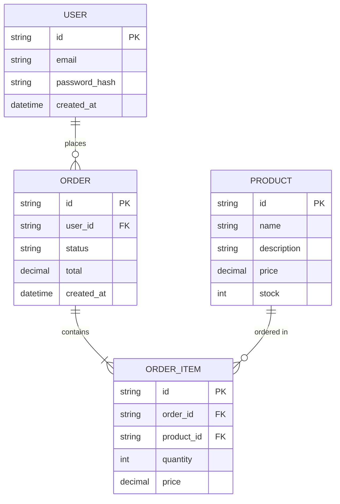

# 数据模型设计

## 项目概述

| 项目 | 内容 |
|------|------|
| 项目名称 | {PROJECT_NAME} |
| 数据库类型 | PostgreSQL / MySQL / MongoDB |
| 版本 | v1.0 |
| 日期 | {DATE} |

## 实体关系图

## 数据表设计

### 用户表 (users)

| 字段 | 类型 | 约束 | 说明 |
|------|------|------|------|
| id | UUID | PK | 主键 |
| email | VARCHAR(255) | UNIQUE, NOT NULL | 邮箱 |
| password_hash | VARCHAR(255) | NOT NULL | 密码哈希 |
| nickname | VARCHAR(100) | | 昵称 |
| avatar | VARCHAR(500) | | 头像URL |
| status | VARCHAR(20) | DEFAULT 'active' | 状态 |
| created_at | TIMESTAMP | NOT NULL | 创建时间 |
| updated_at | TIMESTAMP | NOT NULL | 更新时间 |

**索引**:
- idx_users_email ON (email)
- idx_users_status ON (status)

### 订单表 (orders)

| 字段 | 类型 | 约束 | 说明 |
|------|------|------|------|
| id | UUID | PK | 主键 |
| user_id | UUID | FK, NOT NULL | 用户ID |
| status | VARCHAR(20) | NOT NULL | 订单状态 |
| total | DECIMAL(10,2) | NOT NULL | 总金额 |
| created_at | TIMESTAMP | NOT NULL | 创建时间 |
| updated_at | TIMESTAMP | NOT NULL | 更新时间 |

**索引**:
- idx_orders_user_id ON (user_id)
- idx_orders_status ON (status)
- idx_orders_created_at ON (created_at)

## 枚举定义

### 订单状态 (order_status)

| 值 | 说明 |
|------|------|
| pending | 待支付 |
| paid | 已支付 |
| shipped | 已发货 |
| completed | 已完成 |
| cancelled | 已取消 |

## 数据迁移计划

| 版本 | 迁移内容 | 执行时间 |
|------|----------|----------|
| v1.0 | 初始化表结构 | |

## 数据量预估

| 表 | 预估数据量 | 增长速度 |
|------|------------|----------|
| users | | |
| orders | | |

## 备份策略

| 策略 | 频率 | 保留时间 |
|------|------|----------|
| 全量备份 | 每日 | 30天 |
| 增量备份 | 每小时 | 7天 |
