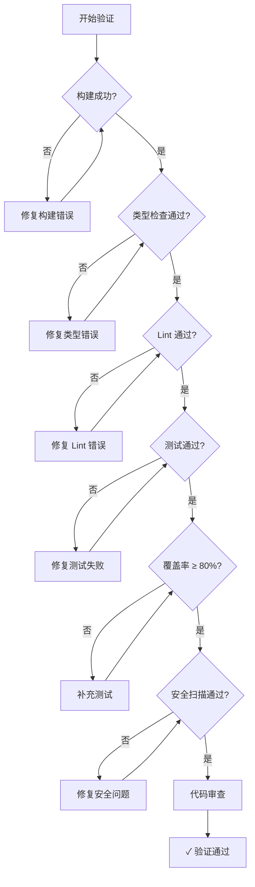

# 开发质量验证系统

用于确保代码质量和开发流程规范的综合验证框架。

## 何时激活

- 完成功能或重大代码变更后
- 创建 PR 之前
- 重构之后
- 代码审查时
- 部署前质量检查

> **注意**：此技能为流程规范，适用于所有项目类型。

## 验证阶段

### 阶段 1：构建验证

```bash
# Node.js 项目
npm run build 2>&1 | tail -20

# Python 项目
python -m py_compile . && echo "Build: OK"

# Go 项目
go build ./... 2>&1
```

如果构建失败，**停止并修复**，不要继续。

### 阶段 2：类型检查

```bash
# TypeScript
npx tsc --noEmit 2>&1 | head -30

# Python
pyright . 2>&1 | head -30
# 或
mypy . 2>&1 | head -30

# Go
go vet ./... 2>&1
```

报告所有类型错误。**关键错误必须修复**后再继续。

### 阶段 3：代码规范检查

```bash
# Node.js/TypeScript
npm run lint 2>&1 | head -30

# Python
ruff check . 2>&1 | head -30

# Go
golangci-lint run 2>&1 | head -30
```

可接受的警告数量：0-5。**关键错误必须修复**。

### 阶段 4：测试套件

```bash
# 运行测试并生成覆盖率报告
npm run test -- --coverage 2>&1 | tail -50

# Python
pytest --cov=. --cov-report=term 2>&1 | tail -50
```

**覆盖率目标：≥80%**

报告格式：

- 总测试数：X
- 通过：X
- 失败：X
- 跳过：X
- 覆盖率：X%

### 阶段 5：安全扫描

```bash
# 检查硬编码密钥
grep -rn "sk-" --include="*.ts" --include="*.js" --include="*.py" . 2>/dev/null | grep -v node_modules | head -10
grep -rn "api_key\|API_KEY" --include="*.ts" --include="*.js" --include="*.py" . 2>/dev/null | grep -v node_modules | head -10
grep -rn "password\s*=" --include="*.ts" --include="*.js" --include="*.py" . 2>/dev/null | grep -v node_modules | head -10

# 检查调试代码
grep -rn "console.log\|debugger\|TODO\|FIXME" --include="*.ts" --include="*.tsx" src/ 2>/dev/null | grep -v node_modules | head -10
```

发现任何密钥或敏感信息，**立即修复**。

### 阶段 6：Git 差异审查

```bash
# 查看变更统计
git diff --stat

# 查看具体变更文件
git diff HEAD~1 --name-only

# 查看变更内容
git diff HEAD~1 -- src/
```

审查要点：

- 变更是否符合预期
- 是否有意外更改
- 变更粒度是否合理（建议单次 PR ≤ 10 文件）
- 提交信息是否规范

## 验证决策树



## 输出格式

运行所有阶段后，生成验证报告：

```markdown
## 验证报告

| 阶段     | 状态    | 详情                    |
| -------- | ------- | ----------------------- |
| 构建     | ✅ PASS | -                       |
| 类型检查 | ✅ PASS | 0 errors                |
| Lint     | ⚠️ PASS | 3 warnings (可接受)     |
| 测试     | ✅ PASS | 45/48 passed, 3 skipped |
| 覆盖率   | ✅ PASS | 85%                     |
| 安全     | ✅ PASS | 0 issues                |

**总体状态**: ✅ READY for PR

### 需要修复的问题

无
```

## 快速验证命令

对于日常开发，使用快速验证：

```bash
# Node.js 快速验证 (跳过测试)
npm run build && npm run lint && npx tsc --noEmit

# Python 快速验证
python -m py_compile . && ruff check . && mypy .

# Go 快速验证
go build ./... && go vet ./... && golangci-lint run
```

## 持续验证模式

对于长时间开发会话，建议：

| 时机         | 验证内容   |
| ------------ | ---------- |
| 完成每个函数 | 局部构建   |
| 完成每个组件 | 组件级测试 |
| 完成每个模块 | 完整验证   |
| PR 前        | 全量验证   |

## 相关技能

| 技能             | 说明         |
| ---------------- | ------------ |
| tdd-workflow     | 测试驱动开发 |
| coding-standards | 编码标准     |
| security-review  | 安全审查     |
| review-team  | 代码审查     |
| quality-team | 测试策略     |
