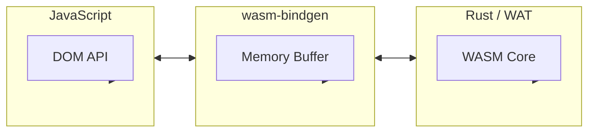

# WebAssembly 模式

> WASM 模块、性能优化、JavaScript 互操作的最佳实践

## 何时激活

- 高性能计算
- 图像/视频处理
- 加密算法
- 游戏开发
- 移植现有代码

## 技术栈版本

| 技术           | 最低版本 | 推荐版本 |
| -------------- | -------- | -------- |
| Rust           | 1.70+    | 最新     |
| wasm-bindgen   | 0.2+     | 最新     |
| wasm-pack      | 0.12+    | 最新     |
| AssemblyScript | 0.27+    | 最新     |

## 架构概览



## Rust + wasm-bindgen

### Rust 代码

```rust
use wasm_bindgen::prelude::*;
use js_sys::Array;

#[wasm_bindgen]
pub fn add(a: i32, b: i32) -> i32 {
    a + b
}

#[wasm_bindgen]
pub fn fibonacci(n: u32) -> u32 {
    if n <= 1 {
        return n;
    }
    fibonacci(n - 1) + fibonacci(n - 2)
}

#[wasm_bindgen]
pub struct Calculator {
    value: f64,
}

#[wasm_bindgen]
impl Calculator {
    #[wasm_bindgen(constructor)]
    pub fn new() -> Calculator {
        Calculator { value: 0.0 }
    }

    pub fn add(&mut self, n: f64) {
        self.value += n;
    }

    pub fn get(&self) -> f64 {
        self.value
    }
}

#[wasm_bindgen]
pub fn process_array(arr: &Array) -> Array {
    arr.map(&|x, _, _| x * 2).unwrap()
}
```

### JavaScript 使用

```typescript
import init, { add, fibonacci, Calculator, process_array } from './pkg/my_wasm.js';

async function main() {
  await init();

  console.log(add(1, 2));

  console.log(fibonacci(10));

  const calc = new Calculator();
  calc.add(10);
  calc.add(5);
  console.log(calc.get());

  const result = process_array([1, 2, 3, 4, 5]);
  console.log(result);
}

main();
```

## 内存管理

```rust
use wasm_bindgen::prelude::*;

#[wasm_bindgen]
pub fn process_buffer(ptr: *mut u8, len: usize) -> *mut u8 {
    let slice = unsafe { std::slice::from_raw_parts_mut(ptr, len) };

    for byte in slice.iter_mut() {
        *byte = byte.wrapping_add(1);
    }

    ptr
}

#[wasm_bindgen]
pub fn allocate(size: usize) -> *mut u8 {
    let mut buffer = Vec::with_capacity(size);
    let ptr = buffer.as_mut_ptr();
    std::mem::forget(buffer);
    ptr
}

#[wasm_bindgen]
pub fn deallocate(ptr: *mut u8, size: usize) {
    unsafe {
        let _ = Vec::from_raw_parts(ptr, 0, size);
    }
}
```

## AssemblyScript

```typescript
export function add(a: i32, b: i32): i32 {
  return a + b;
}

export function factorial(n: i32): i32 {
  if (n <= 1) return 1;
  return n * factorial(n - 1);
}

export function sumArray(arr: Int32Array): i32 {
  let sum: i32 = 0;
  for (let i = 0; i < arr.length; i++) {
    sum += arr[i];
  }
  return sum;
}

export class Vector {
  x: f64;
  y: f64;

  constructor(x: f64, y: f64) {
    this.x = x;
    this.y = y;
  }

  add(other: Vector): Vector {
    return new Vector(this.x + other.x, this.y + other.y);
  }

  magnitude(): f64 {
    return Math.sqrt(this.x * this.x + this.y * this.y);
  }
}
```

## 图像处理示例

```rust
use wasm_bindgen::prelude::*;
use js_sys::Uint8ClampedArray;

#[wasm_bindgen]
pub fn grayscale(image_data: &Uint8ClampedArray, width: u32, height: u32) -> Uint8ClampedArray {
    let len = (width * height * 4) as usize;
    let mut result = Uint8ClampedArray::new_with_length(len as u32);

    for i in 0..len / 4 {
        let r = image_data.get_index((i * 4) as u32);
        let g = image_data.get_index((i * 4 + 1) as u32);
        let b = image_data.get_index((i * 4 + 2) as u32);

        let gray = (0.299 * r as f64 + 0.587 * g as f64 + 0.114 * b as f64) as u8;

        result.set_index((i * 4) as u32, gray);
        result.set_index((i * 4 + 1) as u32, gray);
        result.set_index((i * 4 + 2) as u32, gray);
        result.set_index((i * 4 + 3) as u32, image_data.get_index((i * 4 + 3) as u32));
    }

    result
}
```

## 构建配置

```toml
[package]
name = "my-wasm"
version = "0.1.0"
edition = "2021"

[lib]
crate-type = ["cdylib", "rlib"]

[dependencies]
wasm-bindgen = "0.2"
js-sys = "0.3"
web-sys = { version = "0.3", features = ["console"] }

[profile.release]
opt-level = "s"
lto = true
```

## 加载优化

```typescript
async function loadWasm() {
  const module = await WebAssembly.compileStreaming(fetch('/pkg/my_wasm_bg.wasm'));

  const instance = await WebAssembly.instantiate(module, imports);

  return instance.exports;
}

const wasmModule = await loadWasm();
```

## 快速参考

```rust
// 导出函数
#[wasm_bindgen]
pub fn my_function() -> i32 { }

// 导出结构体
#[wasm_bindgen]
pub struct MyStruct { }

// 构造函数
#[wasm_bindgen(constructor)]
pub fn new() -> MyStruct { }

// 方法
#[wasm_bindgen]
impl MyStruct { }
```

## 参考

- [wasm-bindgen](https://rustwasm.github.io/wasm-bindgen/)
- [AssemblyScript](https://www.assemblyscript.org/)
- [WebAssembly MDN](https://developer.mozilla.org/en-US/docs/WebAssembly)
- [Rust WebAssembly Guide](https://rustwasm.github.io/docs/book/)
