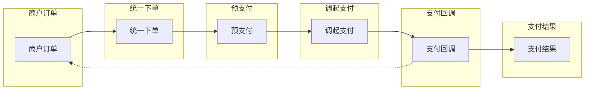

# 微信支付集成模式

> JSAPI、Native、APP、H5 支付以及退款、退款查询、订单查询等最佳实践

> **提示**：统一支付接口、退款、错误处理等通用模式请参考 [payment-patterns](../payment-patterns/SKILL.md)

## 何时激活

- 实现微信支付功能
- JSAPI 公众号/小程序支付
- Native PC 网站支付
- APP 移动端支付
- H5 移动网页支付
- 支付退款处理
- 订单查询与管理

## 技术栈版本

| 技术               | 最低版本 | 推荐版本 |
| ------------------ | -------- | -------- |
| wechatpay-node-sdk | 3.1.0+   | 最新     |
| Node.js            | 16.0+    | 20.0+    |

## 核心概念



## 初始化

```typescript
import { WeChatPay } from 'wechatpay-node-sdk';

const wxpay = new WeChatPay({
  mchid: process.env.WX_MCHID!,
  serial: process.env.WX_SERIAL_NO!,
  privateKey: process.env.WX_PRIVATE_KEY!,
  certificates: {},
  secretKey: process.env.WX_API_KEY,
});
```

## Native 支付 (PC 网站)

### 统一下单

```typescript
async function createNativeOrder(
  orderId: string,
  amount: number,
  description: string
): Promise<{ codeUrl: string; transactionId: string }> {
  const result = await wxpay.v3.pay.pay.transactions.native({
    amount: {
      total: amount,
      currency: 'CNY',
    },
    appid: process.env.WX_APPID!,
    description,
    out_trade_no: orderId,
    notify_url: `${process.env.BASE_URL}/api/payment/wechatpay/callback`,
  });

  return {
    codeUrl: result.code_url,
    transactionId: result.transaction_id,
  };
}
```

### 支付结果通知

```typescript
import crypto from 'crypto';

interface WeChatPayCallback {
  id: string;
  create_time: string;
  event_type: string;
  summary: string;
  resource: {
    algorithm: string;
    cipher_text: string;
    nonce: string;
    associated_data: string;
  };
}

async function handleNativeCallback(ctx) {
  const { body, headers } = ctx.request;
  const signature = headers['wechatpay-signature'];
  const timestamp = headers['wechatpay-timestamp'];
  const nonce = headers['wechatpay-nonce'];
  const serial = headers['wechatpay-serial'];

  const verified = await verifySignature(timestamp, nonce, body, signature, serial);
  if (!verified) {
    ctx.status = 403;
    ctx.body = { code: 'FAIL', message: '签名验证失败' };
    return;
  }

  const paymentResult = JSON.parse(body);
  const { trade_state, transaction_id, out_trade_no } = paymentResult;

  if (trade_state === 'SUCCESS') {
    await updateOrderByTradeNo(out_trade_no, {
      status: 'PAID',
      transactionId: transaction_id,
      paidAt: new Date(),
    });
  }

  ctx.status = 200;
  ctx.body = { code: 'SUCCESS', message: '成功' };
}

async function verifySignature(
  timestamp: string,
  nonce: string,
  body: string,
  signature: string,
  serial: string
): Promise<boolean> {
  const message = `${timestamp}\n${nonce}\n${body}\n`;
  const certificate = await getCertificate(serial);

  const verified = crypto
    .createVerify('SHA256')
    .update(message)
    .verify(certificate, signature, 'base64');

  return verified;
}
```

## JSAPI 支付 (公众号)

### 获取用户 openid

```typescript
async function getOpenid(code: string): Promise<string> {
  const result = await fetch(
    `https://api.weixin.qq.com/sns/oauth2/access_token?appid=${process.env.WX_APPID}&secret=${process.env.WX_SECRET}&code=${code}&grant_type=authorization_code`
  );
  const data = await result.json();
  return data.openid;
}
```

### JSAPI 统一下单

```typescript
async function createJsapiOrder(
  openid: string,
  orderId: string,
  amount: number,
  description: string
): Promise<{ prepayId: string }> {
  const result = await wxpay.v3.pay.pay.transactions.jsapi({
    amount: {
      total: amount,
      currency: 'CNY',
    },
    appid: process.env.WX_APPID!,
    description,
    out_trade_no: orderId,
    notify_url: `${process.env.BASE_URL}/api/payment/wechatpay/callback`,
    payer: {
      openid,
    },
  });

  return {
    prepayId: result.prepay_id,
  };
}

function getJsapiSign(prepayId: string, appId: string) {
  const timestamp = Math.floor(Date.now() / 1000).toString();
  const nonceStr = crypto.randomUUID().replace(/-/g, '');
  const packageStr = `prepay_id=${prepayId}`;

  const signStr = [appId, timestamp, nonceStr, packageStr].join('\n');
  const sign = crypto
    .createSign('SHA256withRSA')
    .update(signStr)
    .sign(process.env.WX_PRIVATE_KEY!, 'base64');

  return { timestamp, nonceStr, package: packageStr, sign };
}
```

## APP 支付

```typescript
async function createAppOrder(
  orderId: string,
  amount: number,
  description: string
): Promise<{
  prepayId: string;
  sign: string;
  timestamp: string;
  nonceStr: string;
  partnerId: string;
}> {
  const result = await wxpay.v3.pay.pay.transactions.app({
    amount: {
      total: amount,
      currency: 'CNY',
    },
    appid: process.env.WX_APPID!,
    description,
    out_trade_no: orderId,
    notify_url: `${process.env.BASE_URL}/api/payment/wechatpay/callback`,
  });

  const timestamp = Math.floor(Date.now() / 1000).toString();
  const nonceStr = crypto.randomUUID().replace(/-/g, '');

  const signStr = [
    process.env.WX_APPID!,
    timestamp,
    nonceStr,
    `prepay_id=${result.prepay_id}`,
  ].join('\n');

  return {
    prepayId: result.prepay_id,
    sign: crypto.createSign('SHA256').update(signStr).sign(process.env.WX_API_KEY!, 'base64'),
    timestamp,
    nonceStr,
    partnerId: process.env.WX_MCHID!,
  };
}
```

## H5 支付

```typescript
async function createH5Order(
  orderId: string,
  amount: number,
  description: string,
  clientIp: string
): Promise<{ h5Url: string }> {
  const result = await wxpay.v3.pay.pay.transactions.h5({
    amount: {
      total: amount,
      currency: 'CNY',
    },
    appid: process.env.WX_APPID!,
    description,
    out_trade_no: orderId,
    notify_url: `${process.env.BASE_URL}/api/payment/wechatpay/callback`,
    scene_info: {
      payer_client_ip: clientIp,
      h5_info: {
        type: 'Wap',
      },
    },
  });

  return {
    h5Url: result.h5_url,
  };
}
```

## 订单查询

### 查询订单 (微信订单号)

```typescript
async function queryOrderByTransactionId(transactionId: string) {
  const result = await wxpay.v3.pay.pay.transactions.id(transactionId);
  return {
    tradeState: result.trade_state,
    amount: result.amount,
    transactionId: result.transaction_id,
    outTradeNo: result.out_trade_no,
    timeEnd: result.success_time,
  };
}
```

### 查询订单 (商户订单号)

```typescript
async function queryOrderByOutTradeNo(outTradeNo: string) {
  const result = await wxpay.v3.pay.pay.transactions.outTradeNo(outTradeNo, {
    mchid: process.env.WX_MCHID!,
  });
  return {
    tradeState: result.trade_state,
    amount: result.amount,
    transactionId: result.transaction_id,
  };
}
```

## 退款

### 申请退款

```typescript
async function refundOrder(
  transactionId: string,
  refundAmount: number,
  totalAmount: number,
  reason?: string
): Promise<{ refundId: string; status: string }> {
  const refundId = `REFUND_${Date.now()}`;

  const result = await wxpay.v3.pay.transactions.outTradeNo(transactionId, 'POST', {
    out_refund_no: refundId,
    amount: {
      refund: refundAmount,
      total: totalAmount,
      currency: 'CNY',
    },
    reason,
  });

  return {
    refundId: result.refund_id,
    status: result.status,
  };
}
```

### 查询退款

```typescript
async function queryRefund(refundId: string) {
  const result = await wxpay.v3.pay.refunds.id(refundId);
  return {
    status: result.status,
    refundAmount: result.amount.refund,
    settlementRefundAmount: result.amount.settlement_refund,
  };
}
```

## 关闭订单

```typescript
async function closeOrder(orderId: string) {
  await wxpay.v3.pay.pay.transactions.outTradeNo(orderId, 'DELETE', {
    mchid: process.env.WX_MCHID!,
  });
}
```

## 支付安全最佳实践

| 措施           | 实现                          |
| -------------- | ----------------------------- |
| 签名验证       | 验证回调签名确保真实性        |
| 幂等性         | 使用订单号防止重复支付        |
| 金额校验       | 服务端校验金额                |
| 异步处理       | 支付回调异步处理              |
| 日志记录       | 完整记录支付流程              |
| 证书安全       | 平台证书妥善保管              |

## 错误码

| 错误码 | 说明           | 处理建议               |
| ------ | -------------- | ---------------------- |
| ORDERPAID | 订单已支付   | 检查订单状态           |
| ORDERCLOSED | 订单已关闭 | 检查订单状态           |
| SYSTEMERROR | 系统错误     | 重试                   |
| BANKERROR | 银行异常       | 联系微信支付           |
| USERPAYING | 支付中       | 等待用户输入密码       |

## 快速参考

```typescript
import { WeChatPay } from 'wechatpay-node-sdk';

const wp = new WeChatPay({
  mchid: process.env.WX_MCHID!,
  serial: process.env.WX_SERIAL_NO!,
  privateKey: process.env.WX_PRIVATE_KEY!,
  certificates: {},
  secretKey: process.env.WX_API_KEY,
});

// Native 支付
const nativeResult = await wp.v3.pay.pay.transactions.native({
  amount: { total: 100, currency: 'CNY' },
  description: 'test',
  out_trade_no: '订单号',
  notify_url: '回调地址',
  appid: process.env.WX_APPID,
});

// JSAPI 支付
const jsapiResult = await wp.v3.pay.pay.transactions.jsapi({
  amount: { total: 100, currency: 'CNY' },
  description: 'test',
  out_trade_no: '订单号',
  payer: { openid: '用户openid' },
  notify_url: '回调地址',
  appid: process.env.WX_APPID,
});

// APP 支付
const appResult = await wp.v3.pay.pay.transactions.app({
  amount: { total: 100, currency: 'CNY' },
  description: 'test',
  out_trade_no: '订单号',
  notify_url: '回调地址',
  appid: process.env.WX_APPID,
});

// 查询订单
const order = await wp.v3.pay.pay.transactions.id('微信订单号');

// 退款
const refund = await wp.v3.pay.transactions.outTradeNo('订单号', 'POST', {
  out_refund_no: '退款号',
  amount: { refund: 100, total: 100, currency: 'CNY' },
});
```

## 参考

- [微信支付开发文档](https://pay.weixin.qq.com/docs/)
- [wechatpay-node-sdk](https://github.com/TheNorthMemory/wechatpay-axios-plugin)
