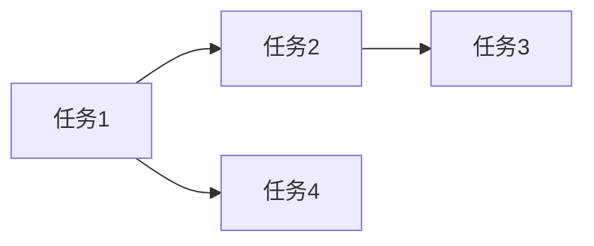

# {Feature Name} 实现规划

> **来源**: {PRD 文档链接}
> **创建日期**: YYYY-MM-DD
> **优先级**: Must / Should / Could / Won't

**目标**: [一句话描述要构建什么]

**范围**: [功能边界说明，包含什么，不包含什么]

---

## 需求规格

### {Specification Name}

**功能**: {功能名称}

**描述**: {功能描述}

**输入**:

| 字段 | 类型 | 必填 | 说明 |
| ---- | ---- | ---- | ---- |
| {field} | {type} | {yes/no} | {description} |

**输出**:

| 字段 | 类型 | 说明 |
| ---- | ---- | ---- |
| {field} | {type} | {description} |

**约束**:

- {约束1}
- {约束2}

**验收标准**:

- [ ] {验收条件1}
- [ ] {验收条件2}
- [ ] {验收条件3}

---

## 任务分解

### 任务 1: {任务名称}

**描述**: {任务描述}

**输入**: {输入数据}

**输出**: {预期输出}

**依赖**: {前置任务，无则填 "无"}

**验收标准**:

- [ ] {标准1}
- [ ] {标准2}

---

### 任务 2: {任务名称}

**描述**: {任务描述}

**输入**: {输入数据}

**输出**: {预期输出}

**依赖**: {前置任务}

**验收标准**:

- [ ] {标准1}
- [ ] {标准2}

---

### 任务 3: {任务名称}

**描述**: {任务描述}

**输入**: {输入数据}

**输出**: {预期输出}

**依赖**: {前置任务}

**验收标准**:

- [ ] {标准1}
- [ ] {标准2}

---

## 依赖关系

### 前置依赖

- [ ] {依赖项1}
- [ ] {依赖项2}

### 后续依赖

- {后续任务1}
- {后续任务2}

---

## 边界情况

| 场景 | 输入 | 预期行为 |
| ---- | ---- | -------- |
| {场景1} | {输入} | {预期行为} |
| {场景2} | {输入} | {预期行为} |

---

## 技术提示

### 相关文件

- {相关文件1}
- {相关文件2}

### 参考实现

- {参考链接或代码片段}

---

## 验收清单

- [ ] 所有任务已完成
- [ ] 所有验收标准已满足
- [ ] 边界情况已处理
- [ ] 依赖项已解决

---

**状态**: Draft / Ready / In Progress / Completed

**负责人**: dev-engineer

**预计工期**: {X} 天
