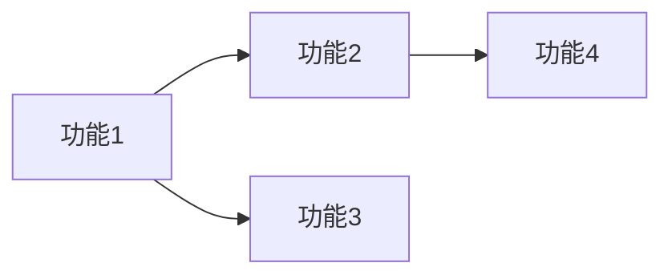
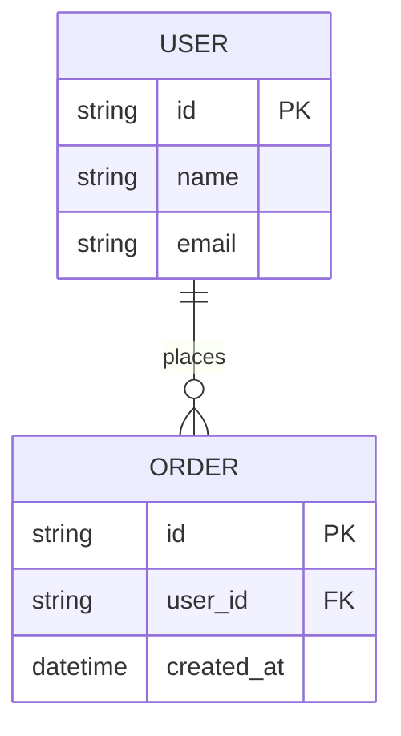

# 产品需求文档 (PRD)

> **文档信息**
>
> - 项目: {project-name}
> - 版本: v1.0
> - 作者: product-strategist
> - 日期: {YYYY-MM-DD}
> - 状态: Draft / In Review / Approved

---

## 1. 概述

### 1.1 产品目标

[一句话描述产品要解决的核心问题]

### 1.2 背景

[为什么现在要做这件事，市场机会、用户痛点、业务价值]

### 1.3 范围

- **包含**: 功能A、功能B、功能C
- **不包含**: 功能D（将在V2实现）

---

## 2. 功能需求

### 2.1 功能列表

| 编号 | 功能名称 | 描述 | 优先级 | 状态 |
|------|----------|------|--------|------|
| F1 | {功能1} | {描述} | Must | Planned |
| F2 | {功能2} | {描述} | Should | Planned |
| F3 | {功能3} | {描述} | Could | Planned |

### 2.2 功能详细说明

#### F1: {功能名称}

**描述**: [功能详细描述]

**用户流程**:

**验收标准**:

- [ ] 标准1: 描述
- [ ] 标准2: 描述
- [ ] 标准3: 描述

**异常处理**:

| 异常场景 | 处理方式 |
|----------|----------|
| 场景1 | 处理方式 |
| 场景2 | 处理方式 |

---

## 3. 需求分解说明

> **注意**: 以下功能将被分解为独立的规划文档，保存在 `plans/` 目录下

### 3.1 分解清单

| 功能编号 | 功能名称 | 规划文档名称 | 优先级 |
|----------|----------|--------------|--------|
| F1 | {功能1} | YYYY-MM-DD-{feature-name-1}.md | Must |
| F2 | {功能2} | YYYY-MM-DD-{feature-name-2}.md | Should |
| F3 | {功能3} | YYYY-MM-DD-{feature-name-3}.md | Could |

### 3.2 依赖关系

---

## 4. 非功能需求

### 4.1 性能需求

| 指标 | 要求 | 说明 |
|------|------|------|
| 页面加载 | < 2s | 首屏加载时间 |
| API响应 | < 200ms | P95响应时间 |
| 并发用户 | > 1000 | 同时在线用户 |

### 4.2 安全需求

| 需求 | 说明 |
|------|------|
| 身份认证 | JWT + OAuth2.0 |
| 数据加密 | HTTPS + AES-256 |
| 权限控制 | RBAC |

### 4.3 兼容性需求

| 类型 | 要求 |
|------|------|
| 浏览器 | Chrome 90+, Safari 14+, Firefox 88+ |
| 移动端 | iOS 14+, Android 10+ |

---

## 5. 数据模型

---

## 6. 界面需求

### 6.1 页面列表

| 页面 | 路由 | 描述 | 对应功能 |
|------|------|------|----------|
| 首页 | / | 首页描述 | F1 |
| 列表页 | /list | 列表页描述 | F2 |

### 6.2 关键界面原型

[插入原型图或描述]

---

## 7. 里程碑

| 里程碑 | 日期 | 交付物 |
|--------|------|--------|
| M1: 需求评审 | YYYY-MM-DD | PRD v1.0 |
| M2: 规划完成 | YYYY-MM-DD | plans/*.md |
| M3: 开发完成 | YYYY-MM-DD | 功能代码 |
| M4: 测试完成 | YYYY-MM-DD | 测试报告 |
| M5: 上线发布 | YYYY-MM-DD | 生产环境 |

---

## 8. 附录

### 8.1 术语表

| 术语 | 定义 |
|------|------|
| MVP | 最小可行产品 |
| PRD | 产品需求文档 |

### 8.2 变更记录

| 版本 | 日期 | 变更内容 | 作者 |
|------|------|----------|------|
| v1.0 | YYYY-MM-DD | 初始版本 | @xxx |
