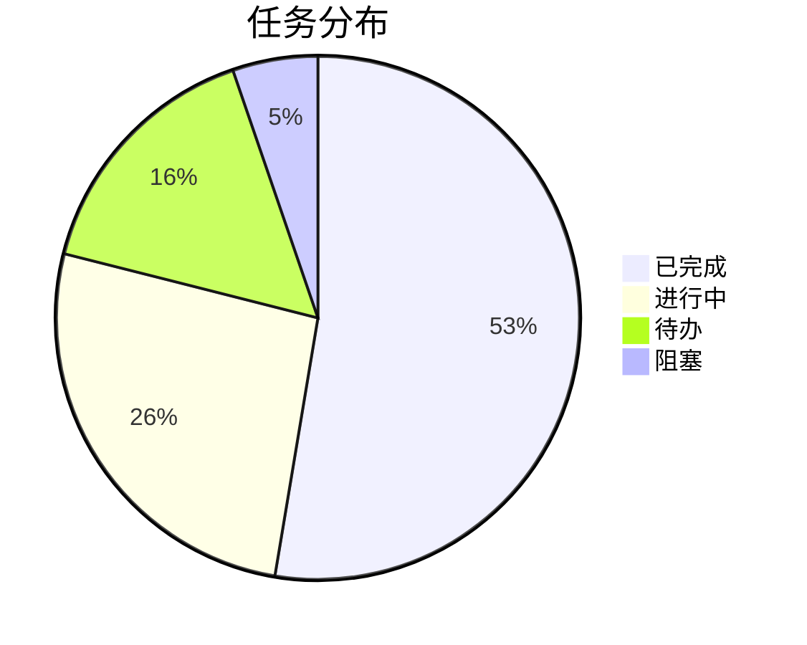

# 项目进度报告

> 项目: {项目名称}
> 报告周期: {开始日期} - {结束日期}
> 报告人: {专家名称}
> 生成时间: {YYYY-MM-DD HH:mm}

---

## 一、整体进度

### 进度概览

```
总体进度: ████████░░ 80%
```

| 指标 | 计划 | 实际 | 偏差 |
|------|------|------|------|
| 总任务数 | X | - | - |
| 已完成 | X | Y | +/-Z |
| 进行中 | X | Y | +/-Z |
| 待开始 | X | Y | +/-Z |
| 阻塞 | X | Y | +/-Z |

### 里程碑状态

| 里程碑 | 计划日期 | 实际日期 | 状态 |
|--------|----------|----------|------|
| M1: 需求完成 | YYYY-MM-DD | YYYY-MM-DD | ✅ |
| M2: 设计完成 | YYYY-MM-DD | - | 🔄 |
| M3: 开发完成 | YYYY-MM-DD | - | ⏳ |
| M4: 测试完成 | YYYY-MM-DD | - | ⏳ |
| M5: 上线发布 | YYYY-MM-DD | - | ⏳ |

---

## 二、阶段详情

### 需求阶段

| 任务 | 负责人 | 状态 | 进度 | 备注 |
|------|--------|------|------|------|
| 任务1 | @xxx | ✅ 完成 | 100% | - |
| 任务2 | @xxx | 🔄 进行 | 60% | - |

### 设计阶段

| 任务 | 负责人 | 状态 | 进度 | 备注 |
|------|--------|------|------|------|
| 任务1 | @xxx | ✅ 完成 | 100% | - |
| 任务2 | @xxx | 🔄 进行 | 40% | - |

### 开发阶段

| 任务 | 负责人 | 状态 | 进度 | 备注 |
|------|--------|------|------|------|
| 任务1 | @xxx | 🔄 进行 | 30% | - |
| 任务2 | @xxx | ⏳ 待办 | 0% | - |

### 测试阶段

| 任务 | 负责人 | 状态 | 进度 | 备注 |
|------|--------|------|------|------|
| 任务1 | @xxx | ⏳ 待办 | 0% | - |

---

## 三、专家工作状态

### 专家负载

| 专家 | 当前任务 | 状态 | 负载 |
|------|----------|------|------|
| product-strategist | task-001 | available | 低 |
| tech-architect | task-002 | busy | 高 |
| ux-engineer | task-003 | busy | 中 |
| dev-engineer | task-004 | busy | 高 |

### 任务分配



---

## 四、风险与阻塞

### 阻塞项

| ID | 阻塞描述 | 影响 | 负责人 | 预计解除 |
|----|----------|------|--------|----------|
| B1 | 描述 | 高 | @xxx | YYYY-MM-DD |
| B2 | 描述 | 中 | @xxx | YYYY-MM-DD |

### 风险项

| ID | 风险描述 | 可能性 | 影响 | 应对策略 |
|----|----------|--------|------|----------|
| R1 | 描述 | 高 | 高 | 策略 |
| R2 | 描述 | 中 | 中 | 策略 |

---

## 五、质量指标

### 代码质量

| 指标 | 目标 | 实际 | 状态 |
|------|------|------|------|
| 测试覆盖率 | 80% | XX% | ✅/❌ |
| 代码审查率 | 100% | XX% | ✅/❌ |
| 技术债务 | <10 | XX | ✅/❌ |

### Bug 统计

| 类型 | 新增 | 已修复 | 待修复 |
|------|------|--------|--------|
| P0 | X | Y | Z |
| P1 | X | Y | Z |
| P2 | X | Y | Z |
| P3 | X | Y | Z |

---

## 六、下阶段计划

### 重点任务

1. 任务1 - 负责人 - 截止日期
2. 任务2 - 负责人 - 截止日期

### 关键决策

| 决策项 | 选项 | 决策人 | 截止日期 |
|--------|------|--------|----------|
| 决策1 | A/B | @xxx | YYYY-MM-DD |

### 资源需求

- 需要的专家支持
- 需要的外部资源
- 需要的决策支持

---

## 七、沟通事项

### 需要同步的信息

1. 信息1
2. 信息2

### 需要的决策

1. 决策1 - 背景 - 影响
2. 决策2 - 背景 - 影响

---

## 附录

### 变更记录

| 日期 | 变更内容 | 变更人 |
|------|----------|--------|
| YYYY-MM-DD | 初始版本 | @xxx |

### 相关文档

- 任务看板: `.ai-team/orchestrator/task-board.json`
- 工作流日志: `.ai-team/orchestrator/workflow-log.md`
- 项目上下文: `.ai-team/shared-context/project-context.json`
