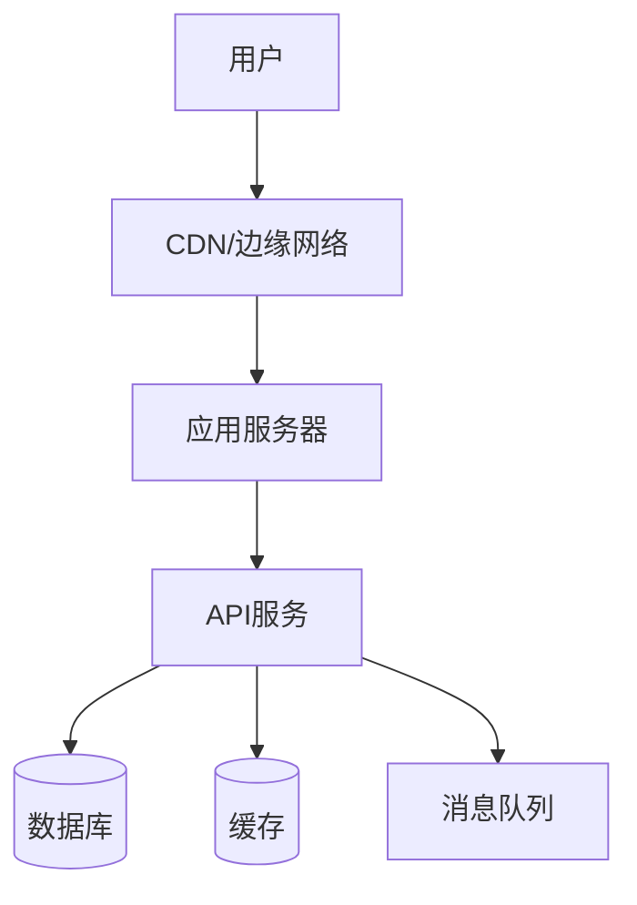
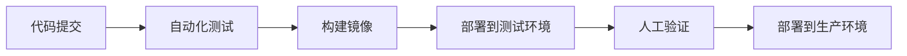

# 技术方案文档

> **来源**: {PRD 文档链接}
> **创建日期**: YYYY-MM-DD
> **作者**: tech-architect

---

## 1. 技术选型

### 1.1 技术栈总览

| 层级     | 技术选型                   | 版本   | 选型理由 |
| -------- | -------------------------- | ------ | -------- |
| 前端框架 | {NextJS/React/Vue}         | {版本} | {理由}   |
| 后端框架 | {FastAPI/Express}          | {版本} | {理由}   |
| 数据库   | {PostgreSQL/MySQL/MongoDB} | {版本} | {理由}   |
| 缓存     | {Redis}                    | {版本} | {理由}   |
| 部署平台 | {Vercel/AWS/阿里云}        | -      | {理由}   |

### 1.2 选型决策路径

按照五维决策模型：

1. **项目类型**: {Web应用/移动端/桌面端/小程序/纯后端}
2. **前端技术**: {SSR/SPA/跨平台}
3. **后端技术**: {Python/Node.js/全栈}
4. **数据库**: {关系型/文档型/混合}
5. **部署方案**: {Serverless/容器/传统}

---

## 2. 系统架构

### 2.1 架构图



### 2.2 架构模式

**采用模式**: {模式A:全栈应用 / 模式B:前后端分离 / 模式C:移动端 / 模式D:微服务}

### 2.3 核心组件

| 组件    | 职责   | 技术实现 |
| ------- | ------ | -------- |
| {组件1} | {职责} | {技术}   |
| {组件2} | {职责} | {技术}   |
| {组件3} | {职责} | {技术}   |

---

## 3. API 设计

### 3.1 API 规范

- **风格**: REST / GraphQL
- **认证**: JWT / OAuth 2.0 / Session
- **版本**: URL路径 (/v1/) / Header
- **数据格式**: JSON

### 3.2 核心接口

| 接口    | 方法                | 路径   | 说明   |
| ------- | ------------------- | ------ | ------ |
| {接口1} | GET/POST/PUT/DELETE | {路径} | {说明} |
| {接口2} | GET/POST/PUT/DELETE | {路径} | {说明} |

### 3.3 认证方案

```
[客户端] --(登录)--> [认证服务] --(JWT)--> [客户端]
[客户端] --(JWT Header)--> [API服务] --(验证)--> [资源]
```

---

## 4. 安全设计

| 安全项      | 方案            | 说明   |
| ----------- | --------------- | ------ |
| 认证授权    | {JWT/OAuth}     | {说明} |
| 数据加密    | {HTTPS/AES}     | {说明} |
| 接口限流    | {Rate Limit}    | {说明} |
| SQL注入防护 | {参数化查询}    | {说明} |
| XSS防护     | {输入过滤/转义} | {说明} |
| CSRF防护    | {Token验证}     | {说明} |

---

## 5. 性能设计

| 性能指标     | 目标值        | 实现方案            |
| ------------ | ------------- | ------------------- |
| API响应时间  | < 200ms (P95) | {缓存/CDN/优化}     |
| 页面加载时间 | < 2s (首屏)   | {SSG/SSR/懒加载}    |
| 并发用户     | {数量}        | {水平扩展}          |
| 可用性       | > 99.9%       | {多可用区/故障转移} |

### 5.1 缓存策略

| 层级       | 技术                   | 用途          | 过期策略 |
| ---------- | ---------------------- | ------------- | -------- |
| 浏览器缓存 | HTTP Cache             | 静态资源      | {时间}   |
| CDN缓存    | Cloudflare/Vercel Edge | 页面/接口     | {时间}   |
| 应用缓存   | Redis                  | 会话/热点数据 | {时间}   |
| 数据库缓存 | Query Cache            | 查询结果      | {时间}   |

---

## 6. 部署架构

### 6.1 环境划分

| 环境       | 用途       | 配置   |
| ---------- | ---------- | ------ |
| 开发环境   | 日常开发   | {配置} |
| 测试环境   | 功能测试   | {配置} |
| 预发布环境 | 上线前验证 | {配置} |
| 生产环境   | 正式服务   | {配置} |

### 6.2 CI/CD流程



---

## 7. 风险与应对

| 风险    | 影响       | 可能性     | 应对措施 |
| ------- | ---------- | ---------- | -------- |
| {风险1} | {高/中/低} | {高/中/低} | {措施}   |
| {风险2} | {高/中/低} | {高/中/低} | {措施}   |
