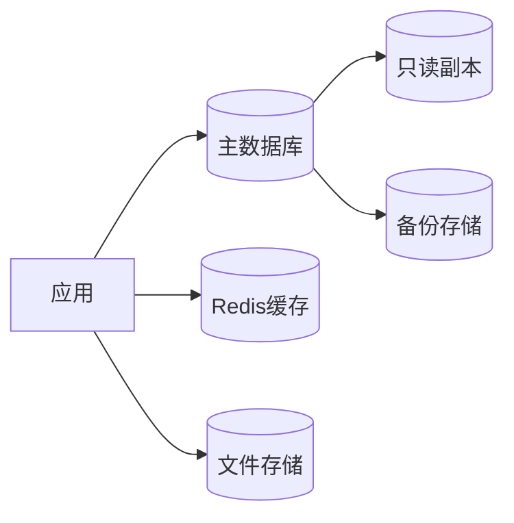
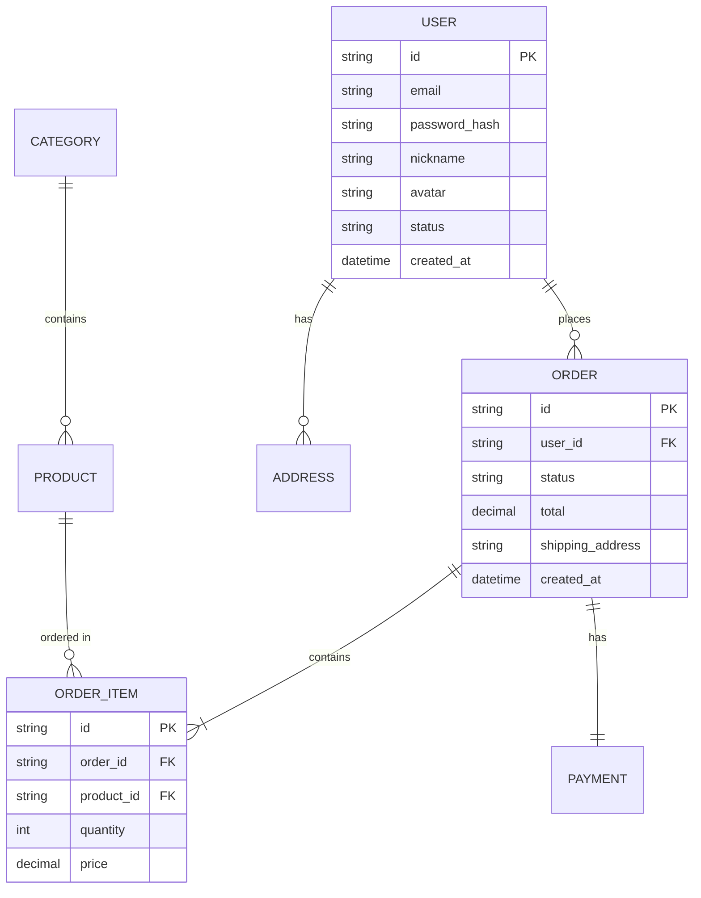

# 数据方案文档

> **来源**: {PRD 文档链接}
> **创建日期**: YYYY-MM-DD
> **作者**: tech-architect

---

## 1. 数据架构概览

### 1.1 存储策略

| 数据类型 | 存储方案 | 选型理由 |
|----------|----------|----------|
| 核心业务数据 | {PostgreSQL/MySQL} | {理由} |
| 缓存数据 | Redis | {理由} |
| 文件存储 | {S3/OSS/本地} | {理由} |
| 日志数据 | {Elasticsearch/ClickHouse} | {理由} |

### 1.2 数据流图



---

## 2. 数据模型

### 2.1 实体关系图



### 2.2 核心实体定义

#### 用户实体 (users)

| 字段 | 类型 | 约束 | 说明 | 索引 |
|------|------|------|------|------|
| id | UUID | PK | 主键 | 主键索引 |
| email | VARCHAR(255) | UNIQUE, NOT NULL | 邮箱 | idx_users_email |
| password_hash | VARCHAR(255) | NOT NULL | 密码哈希 | - |
| nickname | VARCHAR(100) | - | 昵称 | - |
| avatar | VARCHAR(500) | - | 头像URL | - |
| status | VARCHAR(20) | DEFAULT 'active' | 状态 | idx_users_status |
| created_at | TIMESTAMP | NOT NULL | 创建时间 | idx_users_created_at |
| updated_at | TIMESTAMP | NOT NULL | 更新时间 | - |

#### 订单实体 (orders)

| 字段 | 类型 | 约束 | 说明 | 索引 |
|------|------|------|------|------|
| id | UUID | PK | 主键 | 主键索引 |
| user_id | UUID | FK, NOT NULL | 用户ID | idx_orders_user_id |
| status | VARCHAR(20) | NOT NULL | 订单状态 | idx_orders_status |
| total | DECIMAL(10,2) | NOT NULL | 总金额 | - |
| created_at | TIMESTAMP | NOT NULL | 创建时间 | idx_orders_created_at |
| updated_at | TIMESTAMP | NOT NULL | 更新时间 | - |

### 2.3 关系定义

| 主表 | 从表 | 关系类型 | 外键 | 级联操作 |
|------|------|----------|------|----------|
| users | orders | 一对多 | orders.user_id | ON DELETE RESTRICT |
| orders | order_items | 一对多 | order_items.order_id | ON DELETE CASCADE |
| products | order_items | 一对多 | order_items.product_id | ON DELETE RESTRICT |

---

## 3. 数据字典

### 3.1 枚举值定义

#### 用户状态 (user_status)

| 值 | 说明 |
|----|------|
| active | 正常 |
| inactive | 未激活 |
| suspended | 已冻结 |
| deleted | 已删除 |

#### 订单状态 (order_status)

| 值 | 说明 |
|----|------|
| pending | 待支付 |
| paid | 已支付 |
| processing | 处理中 |
| shipped | 已发货 |
| completed | 已完成 |
| cancelled | 已取消 |
| refunded | 已退款 |

### 3.2 字段规范

| 字段类型 | 使用场景 | 示例 |
|----------|----------|------|
| UUID | 主键、外键 | id, user_id |
| VARCHAR(n) | 短文本 | email, nickname |
| TEXT | 长文本 | description, content |
| DECIMAL(10,2) | 金额 | price, total |
| INTEGER | 整数 | quantity, count |
| BOOLEAN | 布尔值 | is_active, is_deleted |
| TIMESTAMP | 时间 | created_at, updated_at |
| JSONB | 结构化数据 | metadata, settings |

---

## 4. 缓存策略

### 4.1 缓存层级

| 层级 | 键命名规则 | 过期时间 | 说明 |
|------|------------|----------|------|
| 用户会话 | `session:{user_id}` | 24h | 登录状态 |
| 用户信息 | `user:{user_id}` | 1h | 用户资料 |
| 热点数据 | `hot:{entity}:{id}` | 10min | 频繁访问数据 |
| 列表缓存 | `list:{entity}:{page}` | 5min | 分页列表 |

### 4.2 缓存更新策略

| 场景 | 策略 | 说明 |
|------|------|------|
| 数据更新 | Cache-Aside | 先更新DB，再删除缓存 |
| 数据读取 | Cache-Aside | 先读缓存，未命中则读DB并写入缓存 |
| 批量操作 | 延迟双删 | 更新前后各删除一次缓存 |

---

## 5. 数据安全

### 5.1 敏感数据处理

| 数据类型 | 处理方式 | 说明 |
|----------|----------|------|
| 密码 | bcrypt加密 | 存储密码哈希 |
| 手机号 | AES加密 | 存储加密后的手机号 |
| 身份证号 | AES加密 + 脱敏 | 显示时脱敏处理 |
| 银行卡号 | AES加密 + 脱敏 | 显示时脱敏处理 |

### 5.2 数据备份

| 备份类型 | 频率 | 保留时间 | 存储位置 |
|----------|------|----------|----------|
| 全量备份 | 每日 | 30天 | 异地存储 |
| 增量备份 | 每小时 | 7天 | 本地存储 |
| 实时备份 | 持续 | - | 主从复制 |

---

## 6. 性能优化

### 6.1 索引策略

| 表名 | 索引名 | 字段 | 类型 | 说明 |
|------|--------|------|------|------|
| users | idx_users_email | email | UNIQUE | 邮箱唯一索引 |
| users | idx_users_status | status | BTREE | 状态查询索引 |
| orders | idx_orders_user_id | user_id | BTREE | 用户订单查询 |
| orders | idx_orders_status | status | BTREE | 状态筛选索引 |
| orders | idx_orders_created_at | created_at | BTREE | 时间排序索引 |

### 6.2 分库分表策略

| 数据表 | 分片键 | 分片策略 | 说明 |
|--------|--------|----------|------|
| {表名} | {字段} | {策略} | {说明} |

### 6.3 读写分离

```
写操作 --> 主库 (Master)
读操作 --> 从库 (Replica 1, Replica 2)
```

---

## 7. 数据迁移

### 7.1 初始化脚本

```sql
-- 创建用户表
CREATE TABLE users (
    id UUID PRIMARY KEY DEFAULT gen_random_uuid(),
    email VARCHAR(255) UNIQUE NOT NULL,
    password_hash VARCHAR(255) NOT NULL,
    nickname VARCHAR(100),
    avatar VARCHAR(500),
    status VARCHAR(20) DEFAULT 'active',
    created_at TIMESTAMP NOT NULL DEFAULT CURRENT_TIMESTAMP,
    updated_at TIMESTAMP NOT NULL DEFAULT CURRENT_TIMESTAMP
);

-- 创建索引
CREATE INDEX idx_users_email ON users(email);
CREATE INDEX idx_users_status ON users(status);
CREATE INDEX idx_users_created_at ON users(created_at);
```

### 7.2 迁移计划

| 版本 | 迁移内容 | 执行时间 | 回滚方案 |
|------|----------|----------|----------|
| v1.0 | 初始化表结构 | - | 删除表 |
| v1.1 | 添加新字段 | - | 删除字段 |
